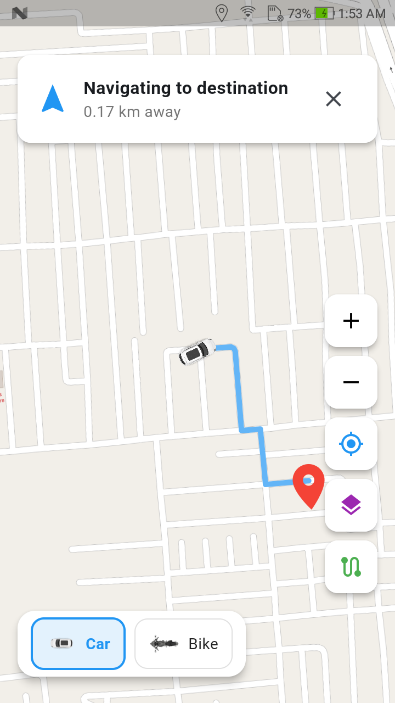

# 🚗 RouteFlow — Live Driver Navigation & Tracking System

RouteFlow is a high-performance Flutter live-tracking and navigation application designed for real-time driver tracking, route planning, and vehicle customization. Powered by **FlutterMap**, **OpenStreetMap**, **OSRM Routing**, and a custom **60 FPS Physics Interpolation Engine**, RouteFlow provides fluid, stutter-free vehicle movement and turn-by-turn navigation visuals.

---

## 📱 App Preview

<p align="center">
  
</p>

---

## ✨ Key Features

* ⚡ **Ultra-Smooth Vehicle Tracking (60 FPS Engine)**: Uses a per-frame `Ticker` callback to perform micro-interpolation (`lerp`) on latitude, longitude, and bearing rotation, delivering continuous fluid motion.
* 🗺️ **OpenStreetMap Tile Engine**: Built on `flutter_map` v6 utilizing direct standard OpenStreetMap tile servers (`tile.openstreetmap.org`) without subdomain warnings.
* 🚘 **Interactive Vehicle Selector**: Floating bottom control card allows users to switch between vehicle models (e.g., **Car** or **Bike**) dynamically on the live map.
* 🛣️ **OSRM Route Calculation**: Automatically fetches real-time driving routes via the Open Source Routing Machine (OSRM) API, rendering route polylines with ETA distance metrics.
* 🔍 **Destination Search & Geocoding**: Integrated search delegate powered by Nominatim OpenStreetMap API for location search and reverse geocoding.
* 📍 **Smart Location Permissions**: Defers location service and permission requests until after the map UI completes its first frame render for a seamless launch experience.
* 🛰️ **Multi-Layer Map Styles**: Easily toggle between OpenStreetMap standard vector view and ArcGIS World Imagery satellite view.

---

## 🛠️ Technology Stack & Dependencies

| Library | Version | Purpose |
| :--- | :--- | :--- |
| **Flutter SDK** | `^3.12.2` | Framework & UI |
| **flutter_map** | `^6.1.0` | Declarative OpenStreetMap widget rendering |
| **location** | `^10.0.2` | Android & iOS GPS location stream provider |
| **latlong2** | `^0.9.0` | Geographical coordinates math & distances |
| **http** | `^1.1.0` | API requests for OSRM routing and Nominatim search |

---

## 📁 Project Architecture

```text
lib/
├── main.dart             # App entry point, Material 3 theme configuration
├── map_screen.dart       # Live map view, 60fps interpolation ticker, UI controls & vehicle selector
└── search_service.dart   # Nominatim API client for location searching & reverse geocoding
assets/
├── car.png               # Car vehicle asset icon
├── bike_im.png           # Bike vehicle asset icon
└── app_preview.png       # App screenshot preview
```

---

## 🚀 Getting Started

### Prerequisites

* [Flutter SDK](https://docs.flutter.dev/get-started/install) installed (v3.12 or higher).
* Android Studio / VS Code with Flutter extensions.
* An Android device or emulator with Location Services enabled.

### Installation

1. **Clone the Repository**:
   ```bash
   git clone https://github.com/your-username/routeflow.git
   cd routeflow
   ```

2. **Install Dependencies**:
   ```bash
   flutter pub get
   ```

3. **Run the Application**:
   ```bash
   flutter run
   ```

---

## 🛡️ Android Permissions Configured

Location permissions are declared in `android/app/src/main/AndroidManifest.xml`:

```xml
<uses-permission android:name="android.permission.ACCESS_FINE_LOCATION" />
<uses-permission android:name="android.permission.ACCESS_COARSE_LOCATION" />
```

---

## 🤝 Contributing

Contributions, issues, and feature requests are welcome! Feel free to check the [issues page](https://github.com/your-username/routeflow/issues).

---

## 📄 License

This project is licensed under the [MIT License](LICENSE).
